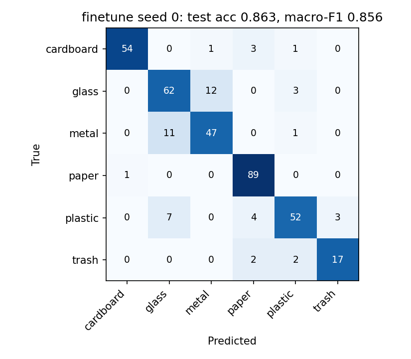
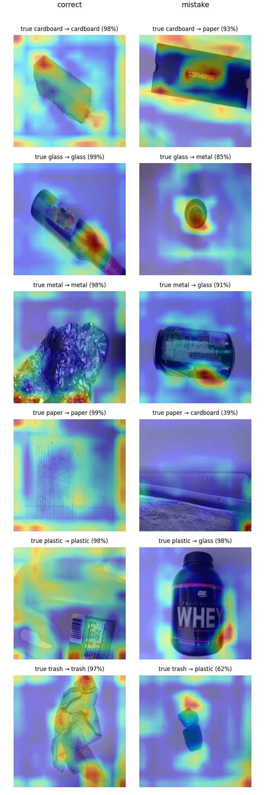

# 基于 AlexNet 的垃圾图像分类 (AlexNet Waste Image Classification)

[](https://colab.research.google.com/github/weirdquantum/alexnet-waste-classification/blob/main/notebooks/colab_run_all.ipynb)
[](https://github.com/weirdquantum/alexnet-waste-classification/actions/workflows/tests.yml)

本科课程 **UESTC 3002: Artificial Intelligence & Machine Learning**（2024–2025 秋季学期）的 Lab Project：用 PyTorch 实现 AlexNet，对 COCO 格式标注的垃圾图像做分类，并与传统机器学习基线（HOG + PCA + 决策树）对比。

在原课程代码的基础上做了两轮代码审查和重构（原始代码保留在 [`legacy/`](legacy/)）：

- **v2**：修复原版的数据泄漏、"最佳模型"保存逻辑、混淆矩阵方向不一致等 15 个问题；换用完整的 [TrashNet](https://github.com/garythung/trashnet) 数据集（6 类）；对比四种 AlexNet 训练配置和两个传统基线。
- **v3**：修复 v2 自查发现的问题——删除标签冲突的图片，把同一物体的近重复照片归组后再划分，消除训练集和测试集之间的泄漏；BN 和偏置不加权重衰减；每个配置跑 3 个随机种子。新增 Grad-CAM、单图预测、端到端测试和 CI。

**最佳结果（ImageNet 预训练 AlexNet 微调，3 个随机种子）：测试集准确率 86.7 ± 0.6%，macro-F1 85.6 ± 0.2%。** 同样的 AlexNet 用原课程训练配方只有 24.2%（全部预测成 paper 一类）；只改训练配方、从零训练可达 80.4 ± 0.5%。训练好的权重可以直接[下载](#预训练权重)。

| 混淆矩阵（微调，seed 0） | Grad-CAM：每类最有把握的正确 / 错误预测 |
|---|---|
|  |  |

## 结果

数据：TrashNet 2521 张（删除 6 张标签冲突的图片），把同一物体的照片归组后按组分层划分为 train 1785 / val 364 / test 372。测试集各类：cardboard 59 / glass 77 / metal 59 / paper 90 / plastic 66 / trash 21。

在 Colab T4 GPU 上运行。每个配置按验证集 macro-F1 选最佳 epoch，测试集只在最后评估一次。CNN 为 3 个随机种子的均值 ± 标准差；传统基线是确定性的，只跑一次。数值为百分比。

| 模型 | 测试准确率 | 测试 macro-F1 | 验证 macro-F1 | 训练时间 (min) |
|---|---|---|---|---|
| HOG + PCA + 决策树（原课程基线） | 34.7 | 31.6 | 31.3 | 1.0 |
| HOG + PCA + RBF-SVM | 63.7 | 62.1 | 62.6 | 0.7 |
| AlexNet，原课程配方 (`course`) | 24.2 ± 0.0 | 6.5 ± 0.0 | 6.5 ± 0.0 | 0.3 |
| AlexNet 从零训练，改进配方 (`scratch`) | 80.4 ± 0.5 | 79.3 ± 0.2 | 83.8 ± 0.4 | 4.5 |
| AlexNet-BN 从零训练，改进配方 (`scratch_bn`) | 79.1 ± 0.6 | 76.0 ± 1.2 | 80.3 ± 1.0 | 4.8 |
| **AlexNet ImageNet 预训练微调 (`finetune`)** | **86.7 ± 0.6** | **85.6 ± 0.2** | 88.3 ± 0.2 | 1.4 |

每类测试集 F1（3 个种子的均值）：

| 模型 | cardboard | glass | metal | paper | plastic | trash |
|---|---|---|---|---|---|---|
| HOG + PCA + 决策树 | 43.5 | 37.6 | 24.8 | 41.4 | 29.2 | 13.3 |
| HOG + PCA + RBF-SVM | 71.3 | 58.9 | 59.5 | 73.4 | 55.2 | 54.5 |
| AlexNet，原课程配方 | 0.0 | 0.0 | 0.0 | 39.0 | 0.0 | 0.0 |
| AlexNet 从零训练 | 86.6 | 75.3 | 77.3 | 89.3 | 73.3 | 74.2 |
| AlexNet-BN 从零训练 | 88.6 | 72.9 | 75.5 | 91.7 | 70.4 | 57.1 |
| AlexNet 预训练微调 | **95.3** | **80.7** | **80.5** | **94.2** | **83.4** | **79.6** |

各实验的指标、混淆矩阵、训练曲线、训练日志和数据划分文件都在 [`results/`](results/) 下，汇总表由 `scripts/summarize.py` 生成。

**如何解读误差范围**：± 只反映训练过程的随机性（初始化、数据顺序、增强），测试集是固定的。372 张测试图本身带来的抽样误差约为 ±1.8 个百分点（准确率 87% 时的二项分布标准误），所以模型之间 2–3 个百分点以内的差距不宜过度解读。

### 主要发现

1. **原课程配方训练不起来，和初始化无关。** 输入只除以 255、无数据增强、Adam lr=1e-3 从零训练 AlexNet，3 个种子都一样：从第 3 轮起训练 loss 基本停在 1.72–1.73，等于训练集类别先验分布的熵（1.7225），即模型只学会了"猜最多的那一类"，所有测试图都预测为 paper（占测试集 24.2%）。v3 已改用与原代码相同的 PyTorch 默认初始化，结果不变。原 notebook 里 loss 停在 1.85 左右是同一个现象，只是被 5 张图的数据集和数据泄漏掩盖了。
2. **训练配方比网络结构更重要。** 同一个 AlexNet，只换成 ImageNet 均值方差归一化、数据增强、AdamW（lr 1e-4）+ warmup/cosine 学习率和 label smoothing，测试准确率从 24.2% 提高到 80.4%。
3. **ImageNet 预训练在每一类上都有提升。** 微调比从零训练高 6.3 个百分点，训练时间约为 1/3。提升最大的是 plastic（F1 +10.1）和 cardboard（+8.7），最小的是 metal（+3.2）。剩下最主要的错误是 glass 和 metal 互相混淆（seed 0：12 张 glass 判成 metal，11 张 metal 判成 glass）。从 Grad-CAM 看，典型错误是深色铝罐被判成 glass、深色不透明的塑料瓶被判成 glass。
4. **AlexNet-BN 早期收敛更快，但欠拟合，且对 trash 类明显更差。** 第 1 轮验证准确率 31–37%（不加 BN 为 26%），但训练准确率最后只停在 86–87%（不加 BN 约 95%），而且最后十几轮学习率已经退火到接近 0，曲线已经走平。v3 去掉了 BN 参数上的 weight decay，欠拟合依旧，说明它不是主要原因；这一配置需要单独调学习率、weight decay 和增强强度（未做）。两者总体准确率差 1.3 个百分点，在测试集抽样误差之内；macro-F1 的差距主要来自 trash：F1 57.1 对 74.2，3 个种子都更低（测试集 trash 只有 21 张）。
5. **传统基线中分类器的选择影响很大。** 同样的 HOG + PCA（保留 95% 方差）特征，决策树只有 34.7%，换成 RBF-SVM 就到 63.7%。原课程基线弱主要在分类器，而不在特征。
6. **Grad-CAM 的观察仅供定性参考。** 正确分类的样本中，模型大多关注物体本身（瓶身、锡箔、塑料袋）；但不少热力图在图像边缘和角落也有较强响应。这可能是模型部分依赖背景，也可能是 AlexNet 最后一层特征图只有 13×13、分辨率太低造成的伪影，Grad-CAM 无法区分这两种情况。

### 与 v2 对比

v3 删除了标签冲突的图片，并按物体分组划分，因此测试集与 v2 不同（372 张 vs 378 张，图片也不同）；v2 只跑了一个种子。下表不是严格的对照实验，只用来看趋势。

| 模型 | v2 测试准确率 | v3 测试准确率 | 变化 |
|---|---|---|---|
| HOG + PCA + 决策树 | 33.3 | 34.7 | +1.4 |
| HOG + PCA + RBF-SVM | 67.7 | 63.7 | −4.0 |
| AlexNet，原课程配方 | 23.5 | 24.2 | +0.7（paper 在测试集中的占比变化） |
| AlexNet 从零训练 | 83.6 | 80.4 ± 0.5 | −3.2 |
| AlexNet-BN 从零训练 | 79.9 | 79.1 ± 0.6 | −0.8 |
| AlexNet 预训练微调 | 88.4 | 86.7 ± 0.6 | −1.7 |

除了不起作用的决策树和只会猜一类的原课程配方，所有模型在 v3 都下降了 0.8–4 个百分点，与"v2 测试集中的近重复图片让结果偏高"的判断一致，下降最多的是 RBF-SVM（−4.0）和从零训练的 AlexNet（−3.2）。不过这里同时改变了测试集和种子数，下降幅度不能完全归因于去重。

v3 加入内存缓存后，从零训练从约 16 分钟缩短到约 4.5 分钟，微调从 4.8 分钟缩短到 1.4 分钟（两次都是 Colab 运行，但没有记录 GPU 型号，不能完全排除硬件差异）。

## 预训练权重

微调模型（`finetune`，seed 0，第 19 轮；测试准确率 86.3%，macro-F1 85.6%）发布在 [Release v3.0](https://github.com/weirdquantum/alexnet-waste-classification/releases/tag/v3.0)：

```bash
curl -L -o alexnet_finetune_trashnet.pt https://github.com/weirdquantum/alexnet-waste-classification/releases/download/v3.0/alexnet_finetune_trashnet.pt
python scripts/predict.py --checkpoint alexnet_finetune_trashnet.pt photo.jpg --gradcam cam.png
```

SHA-256：`fb33e9d2e8b7d63fcd6321506939eb807ad160adba54ac864fe76f58bdc706db`。checkpoint 只包含张量和基本类型，用 `torch.load(..., weights_only=True)` 加载。模型在单一物体、白色背景的照片上训练，对杂乱背景的真实照片效果会差一些。

## 原版代码的问题

| # | 位置 | 问题 | 影响 |
|---|---|---|---|
| 1 | `train.py` / `evaluate.py` / notebook | 训练、验证、测试都读同一份 `annotations.json` | 数据泄漏，notebook 中的 100% 测试准确率没有意义 |
| 2 | `data_coco/` | 每类只有 1 张图，共 5 张 | 无法训练和评估 |
| 3 | `train.py` | `best_accuracy = 0` 写在 epoch 循环内部，每轮被重置 | 每轮都会覆盖保存，"best_model.pth" 实际是最后一轮 |
| 4 | `train.py` | 没有 `model.train()` / `model.eval()` 切换 | 验证时 Dropout 仍然开启，验证结果偏低且有随机性 |
| 5 | 原训练配方 | 输入只除以 255、无数据增强、无 BatchNorm、Adam lr=1e-3 从零训练 | notebook 日志中 loss 停在 1.85 左右（7 类随机猜测为 ln 7 ≈ 1.95），验证准确率在 0–40% 间波动，模型基本没有学到东西 |
| 6 | `model.py` / `ml_evaluate.py` | AlexNet 硬编码 7 类，数据只有 5 类；ML 基线又硬编码 5 类 | 类别数与数据不一致 |
| 7 | `evaluate.py` vs `ml_evaluate.py` | 前者 `matrix[pred, true]`（行=预测），后者 `matrix[true, pred]`（行=真实） | 两个混淆矩阵方向相反，无法直接对比 |
| 8 | `dataset.py` | 只把灰度图转成 RGB，RGBA / 调色板 / CMYK 图片会触发断言；bbox 没有裁剪到图像边界；打开的文件没有关闭 | 遇到非 RGB 图片或越界标注时崩溃 |
| 9 | 各脚本 | 数据路径写成 `data/data_coco`（实际是 `data_coco/`），`dataset.py` 和 `utils/` 中硬编码 `/root/projects/...` | 无法直接运行 |
| 10 | `submission/Data_Processing.py` | 从 annotation 读 `file_name`（COCO 中该字段在 `images` 里），且没有按 bbox 裁剪；路径 `'D:\Combined_COCO_Dataset\annotations.json'` 中的 `\a` 被 Python 解析成响铃字符 | `KeyError`，路径错误 |
| 11 | `submission/Model_Training.py` | 用测试集挑选最佳模型 | 测试结果偏乐观 |
| 12 | `submission/Performance_Evaluate.py` | 缺少 `import torch`，类别名是 `class_1`…`class_7` 占位符 | 无法单独运行，报告不可读 |
| 13 | `mlmodel.py` | PCA 只保留 5 维（受限于 5 个样本）；决策树没有设随机种子；`np.stack` 抛出的是 `ValueError`，代码却捕获 `RuntimeError` | 基线结果不可复现 |
| 14 | 评估 | 只看总体准确率；`torch.load` 未设置 `weights_only=True` | 类别不均衡时（trash 类只有 137 张）看不出小类表现；加载 checkpoint 有安全隐患 |
| 15 | 工程 | 同一份代码在 `.py`、notebook、`submission/` 中重复三遍，没有依赖列表、随机种子和测试 | 难以维护和复现 |

## v2 自查发现的问题（v3 已修复）

| # | 问题 | 证据 | 修复与结果 |
|---|---|---|---|
| 1 | **标签冲突**：TrashNet 中有 3 对逐字节相同的图片被放在两个不同类别下（`glass115` = `metal91`，`glass176` = `plastic152`，`glass389` = `plastic332`）。v2 只保证重复图片落在同一划分，没有检查标签，6 张图都在训练集里带着相互矛盾的标签 | MD5 相同 | 删除全部 6 张（无法确定真实类别） |
| 2 | **近重复图片泄漏**：同一物体常被拍多张，v2 随机划分会把它们分到训练集和测试集两边 | 用 ImageNet AlexNet fc6 特征计算余弦相似度：v2 的 378 张测试图中有 18 张与某张训练图相似度 ≥ 0.9，34 张 ≥ 0.85（如 `metal76` / `metal394` 为 0.99，`metal172` / `metal173` 是同一个铝盘） | 同类且相似度 ≥ 0.85 的图片用并查集归为一组（304 张图归入多图组，最大组 20 张），按组分层划分。阈值高于无关同类图片对相似度的 99.9% 分位数（0.81）。划分后训练集与测试集之间同类最大相似度为 0.848。在 MPS 和 CUDA 上算出的划分完全相同 |
| 3 | BatchNorm 参数和偏置也加了 weight decay（0.05） | AlexNet-BN 训练准确率最终只有约 86%，欠拟合 | 只对卷积和全连接层权重做 weight decay。**欠拟合没有改善**（见主要发现 4） |
| 4 | 只跑了一个随机种子，3–4 个百分点的差距无法判断是否显著 | – | 每个配置 3 个种子，报告均值 ± 标准差 |
| 5 | `course` 配置用的是 Kaiming 初始化，与原课程代码的 PyTorch 默认初始化不同 | – | 新增 `init` 选项，`course` 改用默认初始化；3 个种子仍然全部塌缩到 paper 一类 |
| 6 | 只有单元测试，训练、评估、数据准备脚本没有被测试覆盖；`results/` 为空时 `summarize.py` 报错 | – | 新增端到端测试（在合成数据上跑完整流程）和 GitHub Actions CI；`summarize.py` 给出明确提示 |

## 改进

- **数据**：完整 TrashNet 数据集（课程样例图片 `metal27.jpg` 等即来自 TrashNet）。删除标签冲突的重复图片，把同一物体的近重复照片归为一组后按组分层划分 70 / 15 / 15，同一物体不会同时出现在训练集和测试集。标注统一转成 COCO 格式，数据集类仍然按 bbox 裁剪，和课程任务一致。
- **数据加载**：所有图片统一 `convert("RGB")`，bbox 裁剪到图像边界，类别 id 自动映射到 `0..K-1`，类别数从标注文件读取。
- **训练**：修复最佳模型保存与 train/eval 模式；按验证集 macro-F1 选模型并早停，测试集只在最后评估一次；数据增强（RandomResizedCrop、翻转、颜色扰动）、ImageNet 均值方差归一化、AdamW（BN 和偏置不加 weight decay）+ label smoothing + warmup/cosine 学习率；多随机种子；支持 CUDA / Apple MPS / CPU。在 Linux 上把裁剪后的图片预先缩放并缓存在内存里，减轻 Colab 只有 2 个 CPU 时的数据加载瓶颈。
- **模型**：同一个 `AlexNet` 类支持原版、加 BatchNorm、加载 ImageNet 预训练权重三种用法（参数名与 torchvision 一致），初始化方式可选。
- **评估**：统一混淆矩阵方向（行=真实，列=预测），输出准确率、macro-F1、每类 precision / recall / F1，保存混淆矩阵和训练曲线图；Grad-CAM 可视化模型关注的区域；`predict.py` 可直接对任意图片分类。
- **基线**：改成 sklearn Pipeline，PCA 只在训练集上拟合并保留 95% 方差；在验证集上调参；新增 RBF-SVM 对比。
- **工程**：`src/` 包 + 命令行脚本 + `pytest` 单元测试和端到端测试 + GitHub Actions CI。

## 项目结构

```
.
├── src/wastecls/
│   ├── data.py              # CocoCropDataset（按 bbox 裁剪、可选内存缓存）、数据增强、分层划分
│   ├── models.py            # AlexNet / AlexNet-BN / ImageNet 预训练 AlexNet，checkpoint 加载
│   ├── engine.py            # 训练与推理循环
│   ├── metrics.py           # 混淆矩阵、macro-F1、每类指标、绘图
│   ├── dedup.py             # 标签冲突检测、近重复图片分组（并查集）
│   ├── gradcam.py           # Grad-CAM
│   ├── baseline.py          # HOG + 标准化 + PCA + 分类器 Pipeline
│   └── utils.py             # 随机种子、设备选择
├── scripts/
│   ├── prepare_trashnet.py  # TrashNet zip → 去重、分组 → COCO 标注 + train/val/test 划分
│   ├── train.py             # 训练 AlexNet（--preset course / scratch / scratch_bn / finetune，--seed）
│   ├── evaluate.py          # 评估已保存的 checkpoint
│   ├── predict.py           # 对任意图片分类，可输出 Grad-CAM
│   ├── gradcam_grid.py      # 测试集上每类最有把握的正确 / 错误预测的 Grad-CAM
│   ├── train_baseline.py    # HOG + 决策树 / SVM 基线
│   └── summarize.py         # 汇总各实验（多种子取均值 ± 标准差）为表格
├── notebooks/
│   └── colab_run_all.ipynb  # Colab 一键运行全部实验（结果可存到 Google Drive，断线可续跑）
├── tests/                   # 单元测试 + 端到端测试
├── .github/workflows/       # CI：每次提交自动运行测试
├── results/
│   ├── summary.md           # 汇总表
│   ├── split/               # 本次实验使用的 train / val / test 划分（COCO 标注）
│   ├── hog_tree/  hog_svm/
│   └── course/  scratch/  scratch_bn/  finetune/
│       └── seed{0,1,2}/     # metrics.json、history.json、train.log、混淆矩阵、训练曲线（seed 0 另有 Grad-CAM）
└── legacy/                  # 原始课程代码（代码未改动，供对比）
    ├── experiment.ipynb     # 原实验 notebook（含当时的运行输出）
    ├── dataset.py  model.py  train.py  evaluate.py
    ├── mlmodel.py  ml_evaluate.py  outputs/model.pkl
    ├── data_coco/           # 课程样例数据（5 张图）
    ├── utils/
    └── submission/          # 随报告提交的分模块代码
```

## 运行

**Colab（推荐）**：点击上方 *Open in Colab*，切换到 GPU 运行时后全部运行（T4 上约 1 小时）。

**本地**：

```bash
python -m venv .venv && source .venv/bin/activate
pip install -e ".[dev]"
pytest
```

```bash
mkdir -p data/download
curl -L -o data/download/dataset-resized.zip https://github.com/garythung/trashnet/raw/master/data/dataset-resized.zip
python scripts/prepare_trashnet.py
cp results/split/{train,val,test}.json data/trashnet/   # 可选：使用与上表完全相同的划分
```

```bash
python scripts/train_baseline.py                         # HOG + 决策树 / SVM
python scripts/train.py --preset course --seed 0         # 原课程配方 -> results/course/seed0/
python scripts/train.py --preset scratch --seed 0        # AlexNet 从零训练，改进配方
python scripts/train.py --preset scratch_bn --seed 0     # AlexNet-BN 从零训练
python scripts/train.py --preset finetune --seed 0       # ImageNet 预训练 AlexNet 微调
python scripts/summarize.py                              # 生成 results/summary.md
```

命令行参数可以覆盖 preset 中的任意设置，例如 `--epochs 50 --lr 3e-4`。

```bash
python scripts/predict.py --checkpoint results/finetune/seed0/best.pt photo.jpg --gradcam cam.png
python scripts/gradcam_grid.py --checkpoint results/finetune/seed0/best.pt
```

## 局限

- TrashNet 没有物体编号，"同一物体"是用特征相似度推断的。相似度低于 0.85 的同一物体照片（例如角度差别很大时）仍可能分到不同划分，测试结果可能略微偏高。
- 只有一个固定的数据划分；种子间的标准差不包含测试集抽样带来的误差（约 ±1.8 个百分点）。
- 每张图只有一个物体、背景单一，模型在真实场景（杂乱背景、多物体）中的效果需要另行验证。
- 测试集中 trash 类只有 21 张，这一类的指标波动较大。
- AlexNet-BN 配置没有单独调参，它与不加 BN 的比较不能说明 BatchNorm 本身的好坏。

实验报告和课程讲义未包含在仓库中。
